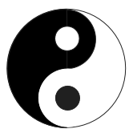
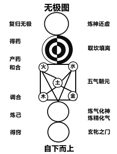

## 6. 隐秘

在民间，传统技艺的传承通常分为四个层次。最外显的一层，是具体的技术、技巧与技艺，这部分内容是“阳中之阳”；第二层，是技艺背后的原理原则、理念理论、方法论等等，这部分内容是“阳中之阴”；第三层，就是所谓口传心授、口耳相传、法不传六耳的“秘诀”。秘诀不是所有人都知道的，但肯定有人知道，并且可以使用语言进行描述或者传达。这俗称的“秘诀”，是“阴中之阳”；最后一层，无法用语言讲述或者传达，甚至连“只可意会，不可言传”都不行。只要还能“意会”，那只能算是秘诀。“不可说，甚至不可意会”这个层次，在传统之中也有个名称，叫“隐诀”。在四个层次中属于“阴中之阴”，也就是纯阴、纯隐。在很多人的观念中，传统文化里那个“不立文字，教外别传”的“禅”，几乎就是文化的终极核心。其实，这“不立文字，教外别传”与民间强调的“不可说，甚至不可意会”，没啥区别。如果某个人，连民间这“不可说，甚至不可意会”都搞不懂，要说这个人能明白“不立文字，教外别传”，那简直是在开玩笑。典型例子，当然是两大祖师——五祖法演与圆悟克勤师徒二人的应对。五祖法演说“频呼小玉元无事，只要檀郎认得声”，圆悟克勤当时站在法演身旁，突然就悟得了“少年一段风流事，只许佳人独自知”。这当然是明白了那个“不可说、甚至不可意会”、“没法传授”的东西。

既已聊到这个话题，那就干脆多说几句。很多人都以为，禅宗的弟子，只要“悟”了，就万事大吉。事实上，没有“悟”的不用说，就算是“悟”了，也未必就真的“万事大吉”。以圆悟克勤为例，他在写出“少年一段风流事，只许佳人独自知”之后，法演祖师就“印可”了他，并遍告山中老少“我侍者悟得禅矣！” 换句话说，法演是认可克勤真“悟”了。表面上看，圆悟克勤这一悟可不得了！因为他当时刚回山才一个月！山下还有一个人在等他，那个人是师弟“佛鉴慧勤”。一个月之前，慧勤不愿跟克勤一同回山，是因为五祖法演骂人太厉害，慧勤之前给骂怕了。克勤悟后下山去找慧勤，跟他说，你看我现在气象怎么样？慧勤说，与一个月之前大不相同！克勤说，对呀，我回山一个月，连气质都变了，你也不要害怕师傅的锤炼呀。慧勤这才跟克勤一同回山。慧勤回山后，在克勤的激励与教导之下，没过多久也悟了。严格说来，离了克勤旁敲侧击式的辅助，慧勤悟，不会那么容易。此时的克勤，显然“很厉害”。但是，五祖法演将克勤留在身边，又过了五年。五年后的某天，克勤负责庙里殿宇扩建。扩建位置上有一棵大树，法演对克勤说，这棵树我看着长大，很不错，你扩建时不要动这棵树。结果法演刚离开，克勤就指挥手下将那树给砍了！法演听说后，勃然大怒，拿起拐杖追打克勤，克勤边躲边跑，躲着躲着，突然想到这“拿棒子打”不正是临济宗的手段吗？于是停下来回过头对法演大吼：老贼，我认得你也！法演一听，立即扔掉拐杖，拍掌哈哈大笑。第二天一大早上堂，法演就当众宣布，克勤是自己的继承人，让克勤收拾行装，可以下山弘法去啦。在克勤的成长过程中，为何他悟了之后，法演并没让他下山去弘法？他当时明明已有弘法的本事，连师弟慧勤，其实也是他激励教导出来的。法演将其留在自己身边的这五年，他与刚开悟那时比，有没有进步？进步在什么地方？如果“一悟即了”，那这五年岂不是白费？法演祖师、克勤祖师，比其他那些也有所“悟”的禅师厉害，就厉害在这多出来的几年时间中。

其实，就连克勤的师傅、五祖法演本人，也不是“一悟就了”的。当初法演在白云守端手下参禅，几经辛苦之后，终于悟得 “山前一片闲田地，叉手叮咛问祖翁；几度卖来还自买，为怜松竹引清风。” 白云守端看到这偈子，就印可了法演，但仍然没放法演下山，而是让法演去负责庙里的厕所。同样是几年之后，某天守端来上厕所，顺口对法演说：有几个从庐山那边过来的僧人，他们说也说得，下语也下得，用因缘考他也考得，但并没有悟，根本不是那块料！法演顿时就懵了，自己也是说得、语得、因缘考也考得，那么自己是不是那块料呢？他一直在想这事儿，睡不着觉，半夜三更起床小便，就在那“唰”地一刹间，豁然大悟。到了早晨，经典的一幕上演了：白云守端上堂，五祖法演从外面走进法堂。守端抬头，正好看到法演跨进大门槛，守端立即拍掌大笑 “演和尚这下子才真的对啦！”（`《续传灯录》记载，守端看到法演进门时的状态，顿时高兴得手舞足蹈，法演本人只一笑而已。`）然后吩咐法演，想离开的话随时可离开，不想离开的话，就去山下负责庙里的磨房吧！

五祖法演在磨房又发生了一些有趣的事情，我在《阴符启微録》中详细分析过那些事。这里举法演与克勤这师徒二人的事例，就是想说，禅宗的名堂太深，单单只提这个“悟”字，未必真的万事大吉。悟之后，恐怕还有些事儿，需要我们去琢磨、去体会。日本禅不如国内，就是这“悟后”的东西，他们不明白。我们之前批评过王守仁的心学，严格说来心学也并不是不对，但确实有欠缺。其欠缺的，就是法演祖师、克勤祖师“悟后”的那一段。资料记载，当代日本禅宗有24个主要分支，其中的20个，是圆悟克勤的徒子徒孙，都打的是临济宗、杨岐派的招牌。总之，日本禅，明显欠“悟后”，估计日本僧人跟克勤祖师学习时，刚有所悟，就跑回日本去了……

既然法演祖师的三大徒弟中，佛果克勤、佛鉴慧勤都聊到了，那么索性跑题再多跑一会儿，干脆聊下法演最小的徒弟：佛眼清远。清远向法演祖师参学之时，无论他说啥，法演祖师都只有一句回答“你悟得好，我不如你”。就这么一句答话，整整回答了清远七年！清远简直快被这答话逼疯了……万般无奈，他跑去请教当时的大师兄元礼禅师。元礼禅师听他说完，猛然用手拧着清远的耳朵，拉着他绕大香炉转了数匝，一边转一边重复法演祖师的话 “你悟得好！你悟得好！” 清远很生气，说：“有冀开发，乃尔相戏耶（`本来希望你给我点启示，你为何戏弄我呢？`）”元礼禅师回答：“你今后悟去，方知今日曲折耳。（`你今后悟了，自然明白今天我为啥这样对待你`）”。清远实在没法可想了，就干脆离开法演祖师，四处参访。他偶然在路上遇到灵源惟清，两人相谈甚欢。清远说：“最近听到京城里一位老尊宿的语录，感觉我完全能听懂，可能我跟他有缘，想去他那儿参访。”灵源惟清说：“法演祖师是天下第一等的大宗师，你何故舍而去之？所谓有缘，不过是知解之师，他的知解与你的理解相应了而已！” 清远这才听从灵源的劝勉，重回法演祖师身边。法演安排清远当知客，转眼又过了好几年，某年冬夜，清远拥炉孤坐，就在他拿棍拨炉灰的一刹那，“啪”地一下，一点火光如豆闪过，清远恍然大悟，随口念出：“深深拨，有些子；平生事，只如此。”从此之后，他机辩峻捷，无人敢当其锋芒，但他却隐居于四面山茅庵内，静默内守，闭口不言，不自以为得。佛眼清远的悟道因缘，原文见《续传灯录》第二十卷。原文的重点，恐怕是前面的“你悟得好”与最末的“闭口不言、不自以为得”。

毕竟本文不是专门讨论禅宗话题的，所以上面两段文字对原文做了一点精简，免得越解释越复杂。好啦，下面不再跑题，回到本章的主题，继续讨论隐诀与秘诀的区别。

隐诀比秘诀更精微。某种意义上讲，无论修为哪种传统技艺，如果没有达到“隐诀”的程度，则算不上是真正“通”了这种技艺。由浅到深学习某种技艺，至少有四个层次：其一，掌握了具体技术、技巧，算是“在学”；其二，明白了技艺的理论方法、规律原则等，算是“入门”；其三，理解了秘诀，并能在实践中正确运用秘诀，算是“登堂”，所以有个专门的名词叫“堂奥”。通常来说，“登堂”的、能洞悉堂奥的，都是技艺传承中的核心传人；其四，师长没法传授、弟子也没处可学，但可能有出类拔萃的弟子，机缘巧合，从师长的日常生活、待人接物中，悟出了技艺背后的“隐诀”，则这个弟子，是真正的“入室”了。这个弟子，才算是真正的“通”了这门技艺。当然，也有可能，这个弟子并非从师长处悟得隐诀，而是在日常生活的某刹间，某事物触碰到了他的某个“点”，他就豁然明白了。比如黄庭坚观看船夫用竹篙撑船，突然悟出行书的用笔之法；再比如某围棋棋手观山间流水，悟出下棋要“流水不争先”，从此成为围棋国手……这些都是例子。

说起来，这世间上以技艺立身的师长，绝大多数人自身也只是“入门”程度，具备“登堂”程度的师长，人数很少。通达“隐诀”的人，往往触类旁通、一通百通。一通百通的结果，是他们立身立业很大可能会选择另外的行业，甚至很可能会选择与他们所学的东西，恰好相反的事业！其中的特例，就很可能：习文的显示为习武，习武的显示为习文。他们通常不再以某技艺的传人自居，当然就不会成为某技艺的“师长”。上述特例导致的后果，是后辈学人，想学文的，得在习武的人中去找老师；想学武的，得在习文的人中去找老师。这种指东打西、欲左先右的状况，看似荒唐，其实有必然性，是天道的必然。说到底，这也是“知白守黑”。“反者道之动”，习武的人要想到达极致，必须习文，因为相反的、对立的那一面中，有大道运行的机关。理解了天道这种“欲左先右”的必然，自然能明白为何传统民间一直传说，书圣王羲之，其实是将长矛、长枪格斗技法，化入了书法；同样也能明白，为何张旭观看公孙大娘舞剑，突然从剑法中悟出了草书的“笔法”，从而成为草书古今第一人的“草圣”。这两例，是典型的“寓武于文，文中藏武；寓文于武，武中藏文”。真正修道的人，在别人眼中是俗人；真正的俗人，会跑去修道。这种现象看似荒唐滑稽，但其实也是天道的必然。从另一个角度讲，“寓武于文，文中藏武；寓文于武，武中藏文”这十六个字画成一幅图，难道不正是一幅阴阳太极图吗？“人之所见，皆是机关”哟。

聊到这儿，又想起五祖法演的那则比喻，这比喻极能说明“俗者是真，真者却俗”的原理。比喻的原文是：

```
三乘人出三界狱，声闻、缘觉必藉方便，如穴地穿壁及自天窗中出。唯得道菩萨，从初入地狱，先与狱子不相疑，一切如常。一日寄信去，觅得酒肉与狱子共吃，至大醉，取狱子衣服行缠头巾，结束自身，却将自己破衣服与狱子着，移枷在狱子项上，坐在牢里。却自手捉狱子藤条，公然从大门出去。参禅人须是恁么始得。
```

此比喻的意思是：声闻、缘觉与菩萨被关在三界构成的牢里。声闻是试图往下挖洞，以逃出三界（`以苦行苦修脱困，必会惊动狱子，最终肯定跑不脱`）；缘觉是试图往上打破房顶天窗逃出三界（`以戒定慧脱困，也容易惊动狱子，很难跑脱`）。菩萨则在牢里跟狱子称兄道弟，等到相互无疑了，然后某天找来酒肉，灌醉狱子，再与狱子互换身份，公然从大门出去。法演祖师这则比喻，真是精彩至极！充分证明了“俗即真”、“真俗不二”的道理。“反者道之动”，徒辈曾评价“演祖见衲子有节义而可立者，室中峻拒，不假辞色！察其偏邪谄佞，所为猥屑不可教者，愈加爱重！人皆莫测焉。呜呼！盖祖之取舍必有道矣。” 法演祖师日常待人接物，与阴邪狠毒之人亲密无间，对其极为爱重；反过来，对那些品行端正、有节有义的人，法演却毫不客气，诸如克勤、慧勤、清远之类，经常被骂得狗血淋头，以至于这三位都曾一度受不了法演祖师，逃离过他。临济宗、杨岐派能一家独大，与法演祖师这种匪夷所思的教育方式，深有关系。我们经常聊到，要将世间法与出世间法打成一片、铸为一个整体，五祖法演这通操作以及上面的比喻，是最好的教材与示范。那么，法演祖师搞的这套，算是隐诀还是秘诀呢？

不再胡扯啦，下面正式开始讨论隐诀与秘诀到底是怎么回事。


### 6.1 明暗

某种意义上讲，本小节，是本文全文最核心、最关键的内容。这部分内容，其实早在二十余年前就公开过，但当时并没有聊这个内容背后，到底隐藏着什么东西。本章以及下一章，将对本小节的内容进行深度阐发与解析。所以，本小节的内容没搞明白的话，可能后面的内容将会完全看不懂。总之，前面五章的内容，不厌其烦地提到“睡觉”二字。本小节围绕这两个字，聊聊另一个相关的词语，就是“一念”，因为有个术语，就叫“一念觉明”。

一念，是说我们起心动念最初的那一念。

到底什么是“一念”？这其实很难说，难说的原因多。首先，在这儿谈“一念”，写下这些谈论的文字，那不知是千千万万多少“念”堆出来的，早已不是“第一念”。这样写，难免就如瞎子摸象，所说的东西都来自于“推测”而缺少实据。难说的原因还有一种，凡是体现为文字的东西，都难免会有剖析、分析与对比，然后才得出结论。这就犹如用一把刀，将一个东西分割成两块或多块进行比较与研究，再定取舍。问题是，现在用“念”来剖析“念”，好比用刀割刀，或者像是蛇吞自己的尾巴，到最后，很可能会弄成一团理不清的乱麻。所以，要把这个第“一念”说清楚，有难度。写有难度，大家阅读理解也有难度，那么就需要各位朋友，在确保自身心态，处于清静、安定的状态下，再来品读本小节。

首先，我们说说什么是“最初”的一念。

这里说的“最初”一念，不是指打出娘胎之时自己“最初”的那念，这“念”可能谁都忘记了。我们这里要谈的，是当我们从一种“无知无觉”“不知不觉”的状态之中，突然升成念头的“那一念”。或者简单点说，是指在我们睡眠时，没有梦，没有知觉，当我们在这种状态中突然“觉醒”时的那第一念。

要对这觉醒刹间的“第一念”有经验、有感觉，很麻烦。往往是芝麻掉进针眼里，碰巧了，偶尔会有这么一两次经验。越是希望有这种体验，反而越是不容易体验到。当然，那些念诵或观想到“一心不乱”之时的人，从“一心不乱”的状态中“出离”出来的时候，会有类似于“第一念”生起的状态，但也仅仅只是类似，并不等于是我们从无知无觉的睡眠中，升起第一念时的状态。唯一比较接近的，是从未到地定念头似动非动，然后动念，滑入欲界定，这个过程与觉醒之时第一念生起的过程，最接近。

我们经常说，梦与醒之间只有一线之隔，或者也可以说成是只有“一念”之隔。如果有充足的时间与外部条件，我们可以尝试多打瞌睡，花上两周或者一月的时间，找一找这梦与醒的界线。如果对这界线有了感觉，已经找到了梦与醒之间的钥匙，那么，看一眼医院里的植物人，哪些能醒来哪些醒不来，你一眼就可以看出。同样道理，那些老年痴呆患者，哪些还能缓解哪些不能，你也可以一眼看出来。

当从无梦也无觉的沉睡中“觉醒”的刹间——应该说，当“觉知”到这“刹间”的时候，其实已经是第二念甚至第三念了。真正的第一念，就是“觉”的“本身”！就在这“觉”的刹间，其实人已经开始从睡梦中醒来。未“觉”之前，有“我”或无“我”，没有区别，但此“觉”的刹间，事实上就是“自我”复苏、是自我与外界进行“区别”的刹间。

当我们还没有“觉”的时候，对我们而言，此刻并没有“外界”与“我”的差别。当“觉”的一刹间，这个“觉”，其实就是一个“分别、区别、比较”的过程，在这个过程之中，通过刹那间的分别与比较，“我”，这个意识就建立起来了！这个意识，是与“非我”——即外界，相比较产生的。“我”，在“觉”的一刹间建立起来，在建立的过程中，“识”紧接就被启动——眼识、耳识、身识……识的作用，是用于感知外界环境，感知到的内容，用于进一步对事物进行“分别、分辨、定义……”。很显然，最先的这个“觉”，应该就是“意识”，因为意识先“动”，所以其他眼耳等五识也就跟着“动”起来了。如果识动了，根没有动，那这个人就进入了梦境（`欲界定`）中，如果物质身体的眼根耳根等也动了，那这个人就彻底“醒”过来了。

通常，我们把“觉”并升起自我意识的这个刹间，称为“一念觉明”。这个“明”字，很有意思。

刚才已经说到了，觉，其实是一个比较与分别、区别的过程。这个“明”字，就是一个通过比较才会产生的词，具有“相对性”。换言之，梦寐时的那种混沌的状态就是“暗昧”——与这里的“明”，相对。事实上，一念觉明这个词，说成是“一念觉暗”，意思完全没有丝毫差别。也就是说，没有暗，就没有明。所谓觉明，其实就是突然发觉自己刚才处于混沌（`暗`）中，发觉自己刚才处于“暗”中，显然当下的这个“能发觉”的东西已不再处于“暗”中，这个“觉”就是“明”，它觉察到了对面的“暗”。所以，一念觉明与一念觉暗，本质上是一回事。觉明的刹间，就是“自我意识”建立起来的刹间。未觉明之前的混沌状态，严格意义上讲也无所谓到底是明还是暗。甚至，其中连时间与空间也不存在。觉明的剎间，不但将自己与外界区别开（`空间上的割裂`），建立起了“我”这个意识，同时也在这刹间，对这个“我”而言，时间开始流动（`念头开始流动`）。如果不存在时间，那么也无所谓“念头”，念头必须存在于时间线上，所以，念头的流动等同于时间的流动，时间在流动背后必定有念头在流动。甚至可以说得更绝对一些：念头，即是时间；时间启动于空间的割裂，导致割裂的源动力，是觉明。

应该说，“一念觉明”，是生命本身的一种功能，哪天这功能不起作用了，也就是这个生命体不再能“分辨、分别、区别……”并升起自我的时候了——这就意味着死亡。当然，有些植物人，生命迹象并未消失，但他不能生起“觉明”与“分别”，无法“认知自我”，无法产生精神现象，也就与死掉了差不多——对他而言，已经无所谓生或死——因为他没有了“比较”的功能。

一念觉明之后，我们会醒来，但不一定保证会完全清醒到现实世界中，也有可能是进入到了梦境之中。其主要的差别是：一念觉明之前，我们无梦无念无时无空；睡梦之中，我们的念头纷繁、杂乱、飘浮。某些情况下，我们一念觉明之后，却并没有清醒到现实中，而是处于了念头流淌的梦中。显然，这里其实有三个层次：觉明前是第一层，觉明后处于念头流淌的梦中是第二层，真正清醒过来是第三层。生不起觉明，无法产生精神现象，这种植物人就极难醒来；虽没醒来但处于做梦状态中，这种植物人有精神现象，适当的时候他就会醒来。

以上所聊，可能有些难以理解，要实际有所体验，就更是难上加难。多年前，我曾跟我弟聊过，我弟当时也听得迷迷糊糊。过了差不多二十年，我弟工作变迁，工作岗位调整到了一个相对偏僻与封闭地方。他有了时间与精力静下心来看书学习，中午也有了午休的空闲。他午休时调有闹钟，闹钟声音是由远而近的钟声。某天中午他午睡，钟声响起来了。后来他告诉我，就在那一刹间，他突然意识到，自己如同“两半”，其中的一半，在睡觉，啥也不知道；另一半，根本从来也不睡觉，“一直”是清醒的。原因很简单：啥也不知道的那一半醒来，突然发觉，钟声响起之时，自己其实一直是“听到了”的，但脑袋没有反应，也就仍然没有“醒”，等“醒”来的时候，才发现那个“一直没睡”的东西，是在声音响第一下之时，就“听到”了的。脑袋没反应之前，有我或者无我、自我与外界，没有明显界限，脑袋反应过来：有钟声！这刹间，自我与外界已经区别开了，区别开，就意味着“已醒来”。

上面这几段，不知大家是否能看明白。其实道理也很简单：比如士兵或者犯人，一大堆人睡在一间房子里，如果有人在门口轻声叫某人的名字，会有一种“怪现象”，被叫的那个人会醒来，而其他人未必会醒。会醒，说明他知道是有人在叫他，不会醒，是他知道，正在叫的那个名字不是他。其实，我们每个人睡觉时都处于这种一半在睡一半清醒的“两半”状态。始终清醒的那个东西，是不需要睡觉的。不仅不需要睡觉，他本身也是没有“明暗”之分的，甚至是无所谓时与空的。如果严格按术语来说明，那么，睡字，单指人躺下闭眼，身心放松；眠字，单指人迷迷糊糊、昏昏沉沉或者做梦的状态；觉（`jiao四声`）字就是“觉（`jue二声`）”，单指人背后那个始终清醒的东西。所以，睡眠与睡觉，两个词的意义是有区别的。

再次强调三个层次：无梦无觉无时无空无物无我无念，大体相当于“未到地”，这是第一个层次；动念即有物我之分，动念即有空间割裂，动念即有时间流动，动念就陷入念头此起彼伏连绵不绝之中，大体相当于“欲界”，这是第二个层次，这个层次中，眼识耳识之类已醒来，但眼根耳根之类没有醒；眼根耳根之类醒来，那就真正彻底清醒到了常态，这是第三个层次。

以上所聊，是本文最核心的内容，上面内容没弄明白，则后面我们要聊的内容，可能很难搞懂。严格说来，下面我们要聊到的内容，已经降级，已经是文字，文字只是念头外化的一种方式，是念头在时间与空间中的存在方式。

念头在时间线上展开，有个必备条件，那就是名相、名词术语。我们每个人每天早上醒来，都在经历“一念觉明”，但真正对这个状态有感受，反而极难遇到。如果遇到过三五次，可能其中某次，我们会发现，念头刚开始“动”的那刹间，我们的意识中有事物，而无名词术语。我们往往是将注意力放到事物上，这个事物的名称，才刹间跟上来。以我弟听到钟声醒来为例，他听到钟声时脑袋并无反应，是过了一会儿，才反应过来：有钟声。这个钟声的钟字，是他把注意力放到这个声音上之后，才刹间跟上来的。这段话的本意是想说，名与实相比，实是本质，名是次要的，也是并不绝对的。有个更典型的例子，是我内舅妈头部受伤动了手术，出院之后去她家看望她，桌子上放着葵瓜子她劝我们吃，但她嘴里说出来，是：请吃粉条，请吃粉条！我们当时有点惊讶，内表哥赶紧跟我们解释，出院后好几样东西从她嘴里说出来都是另外一个词，这几天正在帮她纠正。显然，名词、文字、语言乃至背后的念头，有很大可能，说者与听者之间，未必认识与理解是一致的。（`其实说的不是“吃粉条”而是另一个词。但奇葩的是那个词现在是网络“调侃”流行语，我如果直接写那个词可能导致误会！大家会觉得我在开玩笑！我很怀疑，第一次说出那个网络流行词的人，大脑肯定跟我舅妈在同样位置出了相同的毛病。`）

总之，念头在时间线上展开、流淌，每个念头都是“一句话”，而每句话都必定有或明或暗的“主语”，这个主语是名词或代词。我们从无梦无念、无时无空中升起的第一念，其主语就是“我”，主语的对面是“非我”。请确认自己真的理解了上面这句话，因为后文很多内容，皆是这句话的延伸与引申。

一念觉明意味着自我与外界被分成了两部分，随之，各种事物出现在我们的观感中，事物的名相也刹间跟随而来，与此同时，我们的念头就开始“流动”，头脑中的“语言”开始如同洪水般奔流……如果我们有空闲，多打瞌睡，有意识将这整个过程放缓、放慢，那么我们能从整个过程中体会到很多东西。比如，呼吸是如何“跟随念头”起落，而不断变化的？您能有所感受吗？

这世间的人说话，可以说真话也可能说假话。有人说假话的时候，从表情到语气皆可控制，甚至他可以控制自己的思维，让自己将假话当成真的。从表情到语气到内容，全部可以做假，但有样东西他做不了假，那就是他的呼吸。如果知道呼吸与念头一个是表一个是里，相互关联，那就很容易通过观察一个人的呼吸，知道他当前说的是否是假话。归纳而言就是：思维与呼吸统一，根本上讲，呼吸没法做假，也做不了假。

某丁，曾聊过这样一件事：多年前，某次我（`某丁`）在某处临时帮人修改一个应用程序的代码，当时另有一个人在那儿临时帮忙调整程序的数据库。看得出那人跟在场的其他人关系很好。本来我根本没在意这个人，但我改代码的时候他站我右边肩膀后面，伸着脑袋看我改动。他呼吸的声音传入我耳中，我突然发觉他呼吸的方式是被两套完全不同的“念”控制着的，说明这个人表与里，完全是两个彻底不同的人……意识到这个人有古怪，我趁睱回头瞄了他一眼，果然其人内在思想与外在言行是彻底相反的。几个月之后才知道，搞了半天这个人是需要隐藏身份的特种行业的人，当时临时在那儿帮忙。

跟朋友们聊天的时候经常都在聊梦境，梦境的本质，就是念头的流动。那么，念头流动的速度，与我们感受到的时间流逝速度，有何联系？此外，念头流动的方向与时间流动的方向，又有什么联系？梦境中，念头完全是毫无规律地在“胡奔乱跑”，有没有可能我们在念头的某个点，控制它乱跑的方向甚至修改已跑过的方向？这种修改，对时间的方向而言，意味着什么？有没有可能，我们可以同时让同一个念往两个不同的方向跑？这又意味着什么？最后，大家再想想我们之前提过的一个问题：为什么说，天仙程度的人，对时间与空间的感受异于其他人？

如果大家理解了本小结上述所有内容，不难看出，上面内容其实是将“觉明”的这个“觉”字，视为了“我”字！觉明，就意味着“自我”升起。这些内容是我少年时代从师长处听来的。三十多年来，我也基本是按师长所说，在实际践行。然而，2023年底我师兄看了上述内容后，突然说，他记得的内容，跟我文中所说的内容不一样！我顿时有些惊讶！但听他说完他的感受之后，冷静想想，觉得他说的也有道理。所以，以下将他的说法也记录下来，供大家在实证中对比、参详——

假定有一个人从生下来，就一直处于黑暗之中，那么对他而言，有一个词是根本不可能产生的，这个词就是“黑暗”。如同鱼儿生活在水中，不会知道“水”这个概念。他要知道什么是“暗”只有一种办法，那就是让他看见“明”。这就如同把鱼儿拿出水面，它就立即知道啥是“水”。所以，睡梦中“一念觉明”醒来，是真有个“明”产生了，产生这个“明”的那种动力，就是生命的“蠢动”。当“明”产生，则这个人自然就能知道什么是“暗”。

师兄的感受跟我的感受，最大的区别就是：我感觉“未觉明”之前“无我”，觉明的那个“觉”字，就是“我”！或者更细致一点，可说成是“能觉”的“能”就是“我”；师兄的感觉则是，“未觉明”之前“有我”，不过这个我未见到“光”，所以分不清明暗。“我”是旁观者，明与暗是被观察的对象。归纳而言，我的感受中，只有“我”与“非我”两种情况；师兄的感受中，有明、暗、我（`观察者`），三种情况。舀同一锅饭、坐同一张桌、听同一段话，居然听到之后的结果不同，文化的传承，确实易生歧路。好在，赞成“打瞌睡”反对“打坐”，我跟他是完完全全、毫无疑问、思想统一的！

本小节聊了这么多，大家应该已经意识到：一个善于睡觉的人，一个能将觉真正睡彻底的人，其人可能达到的状态，与那些打坐习禅的人不可同日而语。再此，我再次表明立场：对绝大多数人来说，要坚决禁止打坐习禅（`万里挑一的人，不在此列`），有空少看手机多打瞌睡，老老实实把觉睡好。我撰写《昧道谭丛》时曾提到过，小时候求道，绕了很大的圈、走了很多弯路，结果最后只学会了两个字，一个是吃，另一个是睡。大家以为这个“睡”字，简单吗？

如果说，上面所有章节，全部都是在聊“内”这个层面的情况，那么下面章节，我们将逐步开始聊“外”这个层面的情况。在聊之前，再次强调重点问题：所谓“醒来”，究竟是什么东西，从无知无觉无时无空的状态中“跳”了出来？它叫什么名字？内与外之间的枢纽，又是什么？

如“前引”中所说，本文要讨论关于道家《道德经》与《庄子》中的一些话题。道家拿手好戏，是出谜语、出谜题，让后来人猜谜。说到底，其实也没啥真正意义上的谜题。不过是后人脑袋瓜子太机灵、太聪明、想多了，反而将谜题越说越复杂，到了现代就更是众说纷纭，乱花迷人眼……那么，种种道家典籍中，到底暗中隐藏了些什么呢？废话少说，下面先从《庄子》中的第一个谜语开始聊：北冥里边潜藏的那条鱼。

### 6.2 鲲鹏

先看原文：

`北冥有鱼，其名为鲲。鲲之大，不知其几千里也；化而为鸟，其名为鹏。鹏之背，不知其几千里也；怒而飞，其翼若垂天之云。是鸟也，海运则将徙于南冥。南冥者，天池也。`

在不解释原文的情况下，如果我告诉你说，这段文字写的就是我们上个主题聊的“一念觉明”，就是在描写一个人从稀里糊涂、无知无觉的睡梦之中，到清清醒醒、明明白白醒来的整个过程，你会不会意外？

先说北冥的意思：北方为玄武、为黑暗、为暗昧、为混沌、为糊涂、为冰冷、为昏沉、为静止……“冥”字的本义，也是黑暗、暗昧、混沌、糊涂，冥字还有一重意思，是无边界、无方向、无时间、无空间（`注意这并列的几个词，其中的关键是无方向，正因为无方向所以无空间，正因为无空间所以无时间。`）北冥二字连用，就是指混沌暗昧的状态。强调重点：这状态中无边界、无方向、无时空。简单说，“冥”就是无间，既无时间也无空间。按民间说法，无间，就是终极的地狱。所以地狱之主叫“冥王”，也就是无间之王。

南冥的意思：南方为朱雀、为光明、为清醒、为明确、为明亮、为清晰、为火焰、为热、为运动……南冥的冥字，在这里其实是“明”。之前已聊过，没有暗就没有明，一念觉明就是一念觉暗。因此这里南冥的冥，等同于“明”。地狱之主叫“冥王”，其实也是“明王”。密教修行中讲究“不动明王” “降三世明王” “孔雀明王”等……“降三世明王”意指能控制过去、现在与未来三个方向上的时间，奥妙就在于能控制念头如何“生”。民间修为讲究功夫要下在动念之“先”，禅家讲究“参话‘头’”，如果对这个动念之先的“先”以及话头的“头”没感觉，则降不了三世、当不了“明”王。

北方为水、为坎，南方为火、为离，所以我们才会听到“南明离火”这个词。那么，这里为何用“南冥”而不用“南明”？原因很简单：表面看，这大鹏是从暗昧糊涂，飞向明白清醒，其实是飞向了另外一种糊涂，所以仍然是“冥”。

上面引用的《逍遥游》原文，可以简单翻译为：有一个硕大无朋、力大无穷的东西，突然之间从稀里糊涂、暗昧混沌、无时无空无方向的状态中，跳了出来。跳出来之前它是“鲲”（`“混沌”二字的谐音`），跳出来之后，它化成了“鸟”（`“了了”二字的谐音`）。它的体形大到无边无际，然后，它飞到明白、清楚、光亮、明确的地方去了。那个地方，叫南冥，也叫“天池”（`注意，原文此时，南冥与天池相同`）。整个过程中，这东西体形不知道有多大、力量不知道有多大、连翅膀都遮天蔽日不知有多大！它搅动的，是整个天与地。传统话语体系中的天与地就是时与空。天池二字，可以理解为时间之河。没有时间，念头流动不起来，就谈不上“明”，“明”的必要条件，就是要有“时间”，也就是说，念头必依时间而存在，或者反过来说也可以：时间之所以存在，是因为有念头在流动，念头不流动就谈不上“有”时间。所以，南冥、天池，可以理解为时间之河（`当然也可以理解为念头之河`）。另一层意思就是：有念头存在，自以为自己“明”，其实仍然是“冥”。

刚才说到了一个词，叫“天池”，按《逍遥游》第一段的说法，南冥就是天池。不知道大家注意到没有？庄子刚写完这句话，就在下文没隔多远，用商汤与他的大夫“棘”的对话，提出了另外一种说法，原文为：“汤之问棘也是已：穷发之北，有冥海者，天池也……”。穷发之北就是北方的极点，北方之极的冥海，居然也是“天池”。庄子刚讲过“南冥者，天池也”，这里突然又说北极的冥海是天池。到底是庄子忘了自己上面刚说过的话，是自相矛盾了吗？还是北冥、南冥与天池，本来就是三位一体？如果，南冥、北冥与天池，是同一个东西，那么，这大鹏鸟跳来跳去，看似不得了又了不得，飞了不知道多少亿万公里，其实一直在同一个东西中间打转转（`甚至很可能是原地没动，自认为自己飞了多少远`），你说可悲不可悲？

上面所举段落，出自于庄子的《逍遥游》开篇，《逍遥游》既是整本《庄子》的第一篇，也是整个《庄子》最核心的内容。也就是说，整个庄子全文，一开篇，就是从人“睡醒”开始写起。其中意义，大可品味。“睡醒”之后的一切内容、一切文本，两个字就可以概括完，这两个字就是：比较。比与较，来源于这个“了”字：了了明白、了了分明、了别之识。紧接《逍遥游》的《齐物论》，讲万物千差万别而又“齐一”，千差万别显然来源于“比较”，就连“齐一”这个词本身，也是个经过了比较才会产生的词。整本《庄子》，也就讲完了！所谓《庄子》中的暗隐，就这么回事儿。现在我们不妨自己回答一下：北冥中潜藏的那个东西，到底是什么？五蕴的“识蕴”，跟这东西是啥关系？

其实，在《庄子》中还有一篇与“逍遥游”意义完全相同、文本字面完全相反的文章，叫“知北游”。从篇章的名称就能知道，意思是：智慧向北方，也就是向稀里糊涂、昏沉混沌、无知无觉的方向前进。这题目是不是很有意思？说简单点，我们打瞌睡，头脑从清醒逐步趋向迷糊，这算不算是“知北游”？“知北游”是庄子外篇的结尾。整个《庄子》内、外两篇，内篇开篇以睡醒开头，外篇结尾以瞌睡结尾，头尾中间的内容全基于“比较”。你说，好不好玩儿？是不是很有意思？人们都知道《庄子》是道家的根本经典之一，但并不知道庄子到底“暗中”在说啥。《庄子》通篇的“比喻”与“寓言”，大有玄机。如果有兴趣，不妨将“知北游”的过程，与九定的体系中“从未到地定一步一步退到细住”的状态，做个对比。如此，或许反而能加深我们对九定体系的理解。当然，将《庄子》的体系与“十二因缘法”的体系做点对比，也会让我们有所感悟。传统之中，还在唐宋时代，就已有人提出“庄即禅，禅即庄”，所以后来学界有了“庄禅”的定论。老实讲，最初知道“庄禅”这个词的时候，我是不理解的；现在再看，觉得庄与禅，确实没啥本质区别，有的，只是文字与术语上的差别。下面简单讨论一下这个问题。

我们从“无知无觉无时无空无方向无明暗”之中，升起第一念，这第一念刹间就区别开了我与非我，这种“区别”就是最简单的“思（`行`）”；“思”这种功能已在运行，必然有运行的结论；思，必须有所思的对象，结论，也必须有所针对的对象，这些对象就是“名色”；名色，来源于我们的眼耳鼻舌等六种感官的“感知”；感官接触到事物，就获取到名色；我们接触不同的事物，对这些事物有取有舍，这种取舍源于我们内在的爱憎；外界之所以有各种事物供我们取舍，是因为有“生灭”；正因为有生有灭，所以这世间就产生了“生老病死”这样的事情。生死流转，于是乎，整个世间就“正常”运转起来了。

有没有发现？上段内容，表面看仍然在聊“一念觉明”，仍然在聊“从北冥到南冥”，但若对佛教理论有了解就会发现，上段内容，这不活生生的“十二因缘法”吗？《长阿含经》中“十二因缘法”的原文如下：

```
无明缘行，行缘识，识缘名色，名色缘六入，六入缘触，触缘受，受缘爱，爱缘取，取缘有，有缘生，生缘老死忧悲。
```

按佛教的相关记载，释伽牟尼初转法轮，第一次在人间讲法，是为最早的五比丘讲的“四圣谛”与“十二因缘法”。其中，十二因缘法指出，一切生命陷入生死流转的根本原因，是“无始无明”或者简称为“无明”。无明，是整个佛法的起点！是整个佛法的基石！请注意，这个无明，与“北冥”，或者与“一念觉明”之前那种“无梦无觉无时无空无物无我无念无想”的状态，是一回事。否则，“十二因缘法”自身的逻辑基础，就会站不住脚！关于这个结论，我本人有过啼笑皆非的教训：二十多岁时学佛学，看到佛学说“世间一切生命陷入生死轮回之中，其原因，就是生命产生于无始以来的无明”，我一直不明白佛教讲的这个无始以来的“无明”是什么东西。因为不知道，所以就乱钻牛角尖，用思维从理论上倒着推演，结果得出结论：这“无明”二字，是佛陀“强加”到所有生命脑袋上的！十二因缘法本身的逻辑很严谨，但它的基础，这个“无明”二字根本就不存在，那就证明十二因缘法的基础是假的。我是直到将近四十岁，才明白庄子讲的“冥”就是佛教讲的“无明”，就是一念觉明之前的“混沌”。十二因缘法逻辑的严密性，无可挑剔！换言之，弄明白“一念觉明”中的暗与明，弄明白庄子讲的“冥”，进而就能弄明白什么是佛教的“无始无明”，从而逐步真正意义上弄明白“十二因缘法”，也就从整体上，理清了整个佛法的大框架。我当年由于没搞明白啥是“无始无明”，进而一直怀疑佛教的基础“十二因缘法”站不住脚，实在傻得无语……现在看来，《庄子》内、外两篇与“十二因缘法”暗合、是一码事。换言之，我觉得佛陀与庄子两个人，从同一个出发点，各自推出了一套术语不同、本质相同的理论系统。所以，“庄禅”之说，确实是有道理的。

佛家话语体系中有个词语叫“威音王之前”。“威音王之前”这个词所指的，也就是“时间与空间产生之前”。换言之，就是“动念之前”。如果不懂这词的意思，禅宗的很多公案，是搞不清的。与此类似的隐语还有，比如“父母未生之前”、“天地未分之前”、“空劫之前”。禅宗祖师们总让弟子去参“父母未生之前你的本来面目是什么？”“天地未分之前你在哪儿？”不要把“父母未生之前”理解成我们还未出生之前，其实这句话就是暗指“念头未动之前，你是谁？”，同样的问题还有“夜晚睡着，无梦无想时，主人公何在？”这种类型的隐语，佛家与道家都搞了不少。通常而言，师长根本不会给你解释这些问题背后的所“隐”，需要自己去“悟”。本段内容，希望大家重视，因为我们后面还会聊到本段中的隐语。

仅以文字游戏而言，北冥有鱼的鱼，其实就是“愚”，特指不知不识、昏昏沉沉的状态；化而为鸟的鸟，其实就是“了”，特指明明白白、了了分明的状态，比与较，皆源于“了”。类似这样的文字游戏，如果想多了，反而会越解释越糊涂。再举个例子，魏伯阳的《参同契》，参同契三字是什么意思？每个字单独拆分开是什么意思？两两合并成参同、同契又是什么意思？历来各种解释说得天花乱坠。其实，参就是与天地参（`比较、并立、等同之义，也就是与天地并立`），同就是与天地同，契就是与天地契。简单点说，参同契，就是“寿与天齐”、“与天同寿”，而“天”字就是时间的意思。佛教后来也把这种隐喻套路学了去，最明显的例子是“南无阿弥陀佛”被解释为“无量光与无量寿”，无量光就是无量空间（`地`），无量寿就是无量时间（`天`）。有没有发觉，参同契三字的意思，等于南无阿弥陀佛？前文聊“一念觉明”时，已说过时间与空间究竟是如何产生的。显然，佛教也罢，道教也罢，这儿聊的庄子第一段也罢——它们有区别吗？

有这样一首大家耳熟能详的诗偈：

```
有物先天地，无形本寂寥。
能为万象主，不逐四时凋。
```

天地是指时空，“有物先天地”，当然指有东西存在于时间与空间之前。这句话中的“先”字，是个有比较才会产生的词，对立面是“后”。如果处于时空未动之前，那是说不出这个“先”字来的。“无形本寂寥”的“无形”与“寂寥”，同样是有比较才会产生的词，对立面显然是“有形且热闹”。简单讲，这首诗偈，就是在描述“一念觉明”之前的“混沌”状态（`无始无明`）。人们往往把“有物先天地”这四句诗偈描写的对象，视为“道”，那么下面，我们就聊聊《道德经》第一节的隐喻。

### 6.3 玄德

下面是通行本《道德经》的开篇：
```
道可道，非常道。名可名，非常名。
无名天地之始，有名万物之母。
故常无欲以观其妙﹔常有欲以观其徼。
此两者同出而异名，同谓之玄，玄之又玄，众妙之门。
```

这一段，同样是对“一念觉明”状态的解说。为便于理解，我们需要先将本段中几个关键的词汇，解释清楚。首先解释什么是“玄”。“玄”的本义，是可阴可阳，非阴非阳，能阴能阳，如果换成儒家的说法，其实就是“中”。以下详细聊聊这个话题，争取尽量说清楚。

有个成语叫“模棱两可”。我们桌子的边沿有“棱”，棱，就是90度直角的那条边沿。这边沿也叫“玄”，手指放到这条棱上，到底这手指是偏向于桌子的水平面，还是偏向于垂直面？显然，这是“两可”。更易理解的例子，是菜刀。菜刀如同一张纸片，分为左右两面。我们切菜用的是刀刃。请问，刀刃最中间的这个刃，是这菜刀的左面还是右面？离了左面不会有刃，离了右面也不会有刃，左右两面皆存在，才会有刃。切菜时用的这个刃，既不属于左面也不属于右面。这个刃，就是棱，就是沿，也就是“中”，更是“玄”。菜刀的用，就是玄。

归纳而言，玄，一定源于相反的两个面。任意缺了一面，都不会有“玄”存在。同时，“玄”本身也不属于两面中的任何一面。反过来讲就是：只要有玄存在，一定可以从这个玄出发，找到相反或者相对立的两个面。这两个面，都是从“玄”中，生出来的。换句话说，两个面中的任何一面，都可以称之为“玄”。例如，古文中有“玄天”一词，这里的“玄”，既可以是白也可以是黑，根据上下文的不同语境，“玄天”可能表示白天，也可能表示黑夜，汉代之后，玄天还可以表示“青天”。同类的例子还有“玄衣”，既可以是黑衣也可以是白衣，汉代之后还可以是青绿色、黑红色的衣。类似的还有“苍”字，比如苍天既可表示“白”天，也可表示“青”天。总之，局部即整体，正反两面中的任何一面，其实都可以代表“玄”，但通常而言，“玄”特指正反两面的中间（`儒家所谓的“中”`）。传统“帝王术”，管理者故意让手下人分成左右两派，自己居于“玄”的位置进行宏观调控，其原理与“菜刀用其刃”没区别。

对立的两个面中，任何一面都可以代替“玄”。这种情况，在日常语言里是非常普遍的。比如“为人处世别小心眼，要多往前看嘛”，这句话说成“为人处世别小心眼，要多往后看嘛”，明明使用的词语相反，但整句话的意思并无变化。当然，更典型的例子，比如：孙刘联军在赤壁大胜曹军；孙刘联军在赤壁大败曹军。这也是日常口语中，“对立的两面中任何一面，都可代替玄”的现象。

一念觉明之前，一切皆混沌，甚至连混沌二字都谈不上！因为没有东西在分辨，也没有东西在进行区分；一旦意识到有“混沌”存在，混沌是“暗”，而知道“有混沌存在”的那个东西，就是“明”，明与暗这样的对立面，就产生了。恰恰明与暗未生之前，是玄。明与暗，都是从玄（`这里的玄，就是假名的“混沌”`）中生出来的，所以叫“两者同出而异名”。

我们能分清“明暗”，有个前提，前提就是明与暗之间一定有界线，有边界。如果没有分界线或者边界，我们就分不清“明暗”。所以，“常有欲以观其徼”，徼是边界的意思；“常无欲以观其妙”，意思就是不去区别、不去分辨，不仅不知道是“明”是“暗”，连是“有”是“无”也搞不清，那么，我们可以体会其“妙”。这里的妙（`玅`），本质就是“玄”，观妙就是观玄，术语“玄妙观”就是这个意思。

有与无，都是从“玄”中生出来的，是玄的两面，是“同出而异名”。这里的玄，就是混沌、就是道。当然，玄、混沌、道这三个词，都是假名。真正处在玄、混沌或者道中的时候，没有东西在执行分辨与区别的功能，也不会有玄、混沌与道，这样的“名称”。这样的名称，都是“假名”，所以“名可名，非常名”。中国叫“苹果”，美国叫“Apple”，苹果与Apple都只是“名”，它们都是“指”，它们所指的那个“月”是同一个东西；它们是“能指”，它们“所指”的那个东西，才是“实”。

名，只是一个假借代称。之前聊“一念觉明”时说过，我弟听到钟声，是他注意力放到这个声音上来了之后，才随之出现“钟”这个词。假如这世间上有一个人，从来没有见过“苹果”，见过苹果的人无论怎么向他描述，他也不可能真正知道什么东西是苹果。过了几年后，这个人突然看见了苹果，他可能会觉得自己新发现了一个东西，说不定他还会为这东西另取个什么名称。他回去跟其他人讲，别人一听，就知道他说的是“苹果”或者“Apple”。同样道理，如果我们从来没有对“一念觉明”有感受，从来没有感受过“混沌”，从来没有感受过“道”，没有感受过“玄”，那说得再多也没有用。每天都在睡觉却从来没体会过“觉明”，如同每天都在吃饭却从来没咬到过米，这确实是荒唐的。再次强调，好好睡觉。

取名，有个先决条件，那就是所命名的那个对象，必须有“边界”，无论是实质的边界还是抽象的边界，至少二者必居其一，才能够对这个东西进行命名。比如，这个是桃子，那个是苹果。桃子与苹果是泾渭分明的两个东西，这才能对它们进行命名；再比如，梦与醒，泾渭分明，也可以将其区分成两种状态。这两例都属于有“实质”边界。另外的例子，比如喜与乐这两个，或者惊与恐这两个，就是属于有“抽象”的边界。滴一滴墨水在清水盆中，刚滴下去的时候墨水与盆里的清水区分明显，我们可以说：这一团是墨水，剩下的是清水。等墨水与清水完全混合，我们就无法定义，哪一团是墨水，哪一团是清水，因为二者的“边界”已消失。从混沌中升起第一念的时候，其实我们最早的定义，就是“我”与“非我”，或者也可以说是“暗”与“明”，二者之间区别明显，所以可以取名。简言之，取名，先决条件是必须有边界，其隐藏于背后的，是已经有一个东西，在执行区别、分别、辨别的行动。这个东西，用民间的说法叫“第一念”；用五蕴的说法，就是“了了分明、了别之识”的识；用庄子的说法，就是那个充塞满整个时空、硕大无“朋”的“鹏”；用这里《道德经》的说法，这个，就是能让“两者同出”的“玄”。

上段聊“常无欲以观其妙；常有欲以观其徼”。重读本文读到上段时，突然忆起极其久远之前的一个细节。模糊记得，应该是我十岁冒头时吧，某日在茶铺陪老人们喝茶聊天，聊到上面两句话，某位大爷直接将其读为“常无道，以观其妙；常有道，以观其徼”。我听了目瞪口呆，另俩大爷不以为意。我不能参言，这话就这么过了。等到我成年之后，有了一些训诂学的知识，才知道“欲”字确实在某些情况下可训为“道”字，那么，某大爷的读法，肯定是有出处的。不过，“欲即是道”这四个字从心底冒出来的同时，我浑身刹间布满鸡皮疙瘩……

“玄之又玄”是什么意思呢？一切具有两面性的事物（`比如菜刀的左右两面`），都可以找出两面的交汇处或者说两面“同出”之处。问题是，任何同出之“处”或者交汇之“处”，都可以被“定义”！比如，菜刀的玄，是刀刃，这刀刃二字，就是个定义。“刃”与“非刃”，又是事物的“两面”，这两面的“玄”，这两面的交汇或者同出之处，又是啥呢？是不是已经脑力不够用了？某件事物有“玄”，这玄自身的玄又是啥？这个，就是“玄之又玄”。说起来好像很抽象，其实现实生活中，这种事物与这种情况，放眼皆是。举个最简单的例子：左派右派斗得你死我活，于是出现了“中间派”，中间派不明显时没人会管，等已经出现“中间派”这个词语的时候，又会出现一伙人，专斗中间派。所以，中间派，也有对立面，逃不出“事物必有两面性”的恢恢天网……这个例子虽然不太合适，但确实是理解“玄之又玄”这四个字的好范例。“常无欲以观其妙” “玄之又玄，众妙之门”，前后两“妙”字，其实可以直接使用“玄”字代替为“常无欲以观其玄” “玄之又玄，众玄之门”，意义没变化，只不过朗读起来韵律不好听。

“无名天地之始，有名万物之母”。一旦意识到有个“无”存在，能意识到无存在的那个东西，就是“有”。有与无同出，都是从道中出来的、都是从混沌中出来的、都是从玄中出来的、都是从“觉明”中出来的……就在这一刹间，时间与空间就存在了，就开“始”了！同时，名相也跟着来了，万物因“边界”区分而独立存在，因为“独立存在”所以可为其命名，或者可叫出其名称——也就是“名可名”了。概括而言，“无名天地之始”，表“时”；“有名万物之母”，表“空”。“时”的重要特性是方向，“空”的重要特性是边界。

不要想得太复杂，简单点说，《道德经》这第一篇与《庄子》开篇一样，也是在聊这“一念觉明”的状态。“道可道，非常道；名可名，非常名”就是觉明刹间；“无名、有名”，已经开始产生比较，开始比较就会产生边界，伴随边界，对边界内的东西进行定义，于是产生名相，进而名词术语就会跟来——整个世界，就从人的心底“复活”了，整个人，也就“醒来”了。整个世间万相的本质，也就决定了：万相皆缘于比较、区别、计较，区别与比较产生界线，界线分割开的部分产生名相与名称。所以，《道德经》下文第二章紧跟的，就是“美与恶、善与不善、长与短、高与下、音与声……”之类全部基于比较、基于两面性的事物（`如同《逍遥游》之后跟的是《齐物论》，齐物论说到底，就是把两字用到了极致：比较。所以，老庄二人没啥区别；佛教基石十二因缘法，又与老庄没啥区别`）。两面所用，就是玄。所谓“玄德”，当然就是“得玄”。小心哟，《道德经》中的“玄德”二字，出现过几次？分别出现在什么地方？不同地方的意思，有差别吗？

好啦，“不求其名，但求其实”，那么各位，苹果，你真的吃过了吗？

其实人人都吃过，人人每天都在吃，人人都一样。不用考虑五眼九定之类的东西，把瞌睡睡踏实就很好。“不轻初学，不重老参”，轻与重都是扯淡，人人都一样，每个人每天都在经历从梦到醒的整个过程，哪有啥功夫的深浅高低之别？要说区别，不过就是有些人能将这个过程放慢放缓，有丰富的体验；另一些人，心性猴急，没有用心去体会而已。人人本自具备，如若不相信，则难免奔走追寻……

本文初稿分享给朋友们征求意见时，有不止一位朋友，反馈回大体相同的意见： 佛教讲明心见性，并且说这个“性”是人人本自具足的。没想到你这文档说，人人本自具备的，是打瞌睡中的精神状态！总觉得佛教讲的“自性”、“无明”之类，未必如你文中所写这么简单啊！ 几位朋友的这个反馈，可能代表了很多人的疑问，我收到反馈后，未做解释。未解释的原因有两方面。一方面，是承认朋友们的想法，自性与无明之类，真的并非我文中所写这样。不是我文中所写这样，所以尽管去追求自己认为正确的答案即可。另一方面，是因为人心如钟摆，傲慢与怯懦是同一种心态，是钟摆的左右两极。觉得“自性”或者“无明”没我写的这样简单，这种想法体现出来的心态，恐怕就是“高推圣境”。高推圣境，觉得“不会这么简单”，这是自身心性怯懦的表现，怯懦者迟早会在机缘合适时转变成傲慢者。心性不左右晃荡，真正具备平常心，这并不容易。另外，圣境平易。如果圣境不是平易的、平常的、平实的，那具有这圣境的人，一定不可能具有平常心！一个自认自己已是“圣人”的人，其达到的“圣境”肯定不平常，此人必是魔、邪、妖三者之一。所以，对朋友反馈回的意见，我未做解释。此刻写下这段文字，算是一个总回复。

《道德经》开篇这几句话，历代注解成千上万。其中最朴实、最朴素的解释，就是“河上公章句”。现代考古发掘出的《老子》帛书甲乙本、郭店楚简《老子》等，也反证了“河上公章句”中很多断句、句读、通假字的使用，与挖出来的这些更老的版本，是一致的。所以，某些“秘传”版本，可能过于“标新立异”。比如有师长讲过一种秘传的句读法，将第一句读为“道可，道非，常道；名可，名非，常名”。其实一听就明白，这种句读将“可、非”二字对立起来，成为一阴一阳，也就是阴阳两面，两面合在一起，就构成了“常”。这种断句直接翻译成最简单的大白话，可以解释为：认可某种道理与否认某种道理，两种情况合在一起，就是世间最正常的状态；既有好名又有坏名，这也是这世间最正常的状态。冷静想想，这种句读与这种解释，显然也是“二者同出、二者合并即是玄”，所以从义理阐示的角度出发，师长传授的这种断句，肯定是对的！作为“秘传”的断句方法，当然有“秘”的价值与意义！但对比帛书或者楚简，这第一句原文为“道可道也，非常道也；名可名也，非常名也”，有语气词“也”字在，那显然是不能断句成“道可，道非”之类。仔细看“河上公章句”的断句，对比帛书与楚简，就没有大区别。

最后，聊点私人性质的“私见”。《道德经》中有“常无欲以观其妙；常有欲以观其徼”的语句。我们之前讨论《心经》的时候已明确说过，“观”与“照”两字在心力上有强与弱的区别。这里的“观其妙”与“观其徼”为何不是“照其妙”“照其徼”？上文我们解释“观其妙”与“观其徼”的意义之时，是按传统道家的常规说法、标准说法，在解释。但我个人很怀疑，这两句话是否存在另外的解释方式：

如果我们没有心力，我们能发现事物的“妙”（`“常无欲”，可解释为无心力存在。无心力之观，确实能见到些古怪的、非“常态”的东西。这种状态，确实可称为“妙”`）；如果我们有心力，我们只能觉察到事物与事物之间的“边界”（`“常有欲”，可解释为有心力存在。有心力之观，只能看见“一半”真实的世界。所能看见的，都有明确“边界”，也就是都有明确的“徼”`）。更直白的说法就是：我们是弱观察者甚至是非观察者时，我们能体会到这世界的“妙”；我们是强观察者，我们看到的将是已经“固化”、已是“必然”的世界。当然，这种解释，传统道家没这说法，是个人私见。

上段文字中的“欲”字，可以解释为我们内心的“方向”或者“朝向”。之前我们聊过，时间、空间、方向，这三个关键词中，真正重要的是“方向”。大鹏从北冥向南冥，正因为有这个“向”，才产生了南与北这样的空间概念，也就是方向产生空间。有了南与北这样的空间，从北往南，空间位置的变化就会产生时间概念，也就是空间产生时间。所以，时空产生于方向。这个“向”本质就是“欲”，常有欲、常无欲，就可以解释为“有方向”与“无方向”。前面提到过“欲即是道”，那么也可以说成是“方向即是道”。请问，方向，是直线的吗？如何看待太极图中黑与白各自的“方向”？



以上，我们对《道德经》开篇第一章的意思，做了个简单的剖析。小结一下的话，我们可以将第一章的意思归纳为：莫名其妙、稀里糊涂、无时无空、无规无矩、无方无向的那个状态，我们可以用语言对其进行“描述”与“表达”。但描述与表达出来的，就已经不再是无方无向、无时无空那种状态了；要描述与表达那状态，必须使用名词术语，但名词术语只是“能指”，毕竟不是那种状态本身，看到名词术语，也未必真的明白那种状态。从无到有，从混沌到觉明，时间开始流动，所以叫“始”；已经觉明，空间已产生，于是可以分辨万物，万物皆纳于“空间”中；有与无，两者都是从“玄”、 从“混沌”中生出来的；有与无虽然文字不同，但两者都可以称之为“玄”；世间一切的“妙”，都是从这整个过程、整个状态中产生的。


### 6.4 阴阳

本小节是2023年底增补的内容。增补在这个位置其实是不合适的，因为破坏了前后文的整体性。如果想从整体上把握本文的体系，建议就跳过本节，直接看下节。明知道此处插入本小节对全文整体思路有影响，但仍然加入了本节，是因为感觉有些问题需要先说清楚，这些问题归纳而言，就是：阴阳。

从混沌中生出觉明，假如使用图像来表示的话，我们可以将图像画成黑中生出了白，然后黑白对立，阴阳二分。但这个图像无法表达“无中生有”，所以，传统之中，是用一个圆圈表示“无极”，用黑白对立的圆环，表示太极。无极图放在太极图的顶部，这就是民间所谓的“无极生太极”。用宋儒周敦颐先生的原话来说，是“无极而太极”，原话中的“而”字，其实比民间用的“生”字，更准确。至于准确在何处，过于细微，这里不探讨。此处先看图，然后我们再往下讨论，图如下。


宋儒周敦颐先生撰写过一篇小文，名叫《太极图说》。此文大体内容就是：无极而太极，太极生阴阳两仪，两仪生四相、生八卦，阴阳流转，就产生了五行“金木水火土”相互之间的生克变化，于是，“万物化生”，整个物质世界就“运转起来了”（`某种意义上讲，《太极图说》是理学版的“十二因缘法”，自然就该成为理学的理论基石。`）。如上图所示，仔细看图中的第二层与第三层：第三层方形左上角是“火”，右上角是“水”；第二层左半边，黑色半环为阴，白色半环为阳，则正好是“离卦”，是火；同理，第二层右半边，就是“坎卦”，是水。也就是说，第二层与第三层的关联，就是水火二卦，水火二卦分别表示青年男女（`不是壮年与少年，壮是震与巽，少是艮与兑`），所以就关联到第四层：乾道成男，坤道成女。注意，图中的“五行”，需按《阴符启微録》所讲的“循环、平衡”去理解，不能按民间那种机械的、真的把世间万物分成“金木水火土”的那种思路，去解释。当然，“不能”不是“不行”，也可以按民间那种机械的五行分类方式去理解，但这种理解，有特殊作用。特殊作用，意味着后患无穷。知黑守白，请守住“不能”。

我无意于从知见、考据或者理论的角度，去评判周子的《太极图说》。仅鉴于个人所学，我非常佩服周子将阴阳与五行这两套思维模式给统一了起来。事实上，阴阳理论（`八卦体系`），属于我国黄河流域、中原地区的思维模式；五行理论，属于我国长江流域，大体算是“楚国地域”的思维模式。两种思维模式各有特点，八卦体系偏静态，五行体系偏动态。阴阳体系属于黄帝一族的思维形式，五行体系属于炎帝一族的思维形式。早期，两种体系其实是不“兼容”的。战国的邹衍是第一个试图将两体系融合起来的人，但邹衍融合很生硬、很机械。周子《太极图说》，相对邹衍的说法，更易让人信服。至少从理论的角度去反推，会发现周子所说，没毛病。

陆九渊承认“太极”批评“无极”。如果从“一念觉明”的立场来看，陆九渊显然不明白“无极”所指，其实就是“混沌”（`太虚`），就是无时无空无知无觉之前的那个状态。无极到太极，“太极”，阴阳剖分，阴阳对立，当然就是“觉明”的结果。显而易见，无极到太极再到“物质世界运转起来”，描述了从“形而上”过渡到“形而下”的整个过程。炎帝五行理论输给黄帝阴阳理论，原因就在于“五行”描述的是物质世界的生克变化，已经是“形而下”！与“形而上”相比，略矮半筹。

以上所述，是按周敦颐先生《太极图说》的常规说法在讨论。《太极图说》影响极为巨大。北宋之后的道家，也将周敦颐先生的图“借鉴”而来，用以描述“丹道”的体系。典型图例，如下所示。



图中“自下而上”这几个字，脑袋稍清醒一点点，就能明白，这根本就是“知北游”，根本就是从清醒到糊涂地“打瞌睡”嘛！“取坎填离”，离是清醒明白；坎是昏黑阴沉，拿“昏沉”去填“明白”，就这么回事！图中唯一蒙人的，就是最下面的“得窍”，知道什么是“玄牝之门”。真明白这“窍门”，那图就简单得不值一看了。其实，真正值得注意的是：为何同一幅图，理学能用，丹道也能用？这是不是有点什么问题……

从混沌到觉明，“我”与“非我”即对立起来，这个过程本身就包含了两层意思：阴阳本一、阴阳对立。因此，通过画图，用黑与白来描述这种“本一” “对立”，那无论是哪个人画的，画出来的结果应该都差不多。所以，很多人认为“太极图”是宋朝才出现，另有少数学者认为早在《老子》中就暗含了太极图，应该说，少数人的看法，是对的。

五代至宋代，学者们通过对太极图的参悟，反过来刷新了他们对八卦与六十四卦内涵的认识。这些认识的集大成者，就是邵雍。邵康节先生的巨著《皇极经世书》，也是一部先讲果后讲因的“倒置书”（`咦？为什么会说“也”？`）。其原理，集中在《观物内外篇》中。记得朱熹说过一句话，原话记不得了，大意是：看完邵康节先生的《观物内外篇》之后，再看任何与易经有关的书，都如同嚼蜡，不再有滋味。朱熹这说法，我深以为然！深有同感！学习易经，讲究“理气象数”四个字。“象”与“数”这两方面，讲得最好、最标准的，确实就是邵子的《观物内外篇》。理解了“象”与“数”，反过来，我们就能理解最核心的“理”。如果有雅兴，将宋代之后重要的易学著作都翻一遍，会发现，几乎所有著作“理气象数”四个方面，全部是囿于“形而下”在谈！当然，有物质世界存在，才谈得上“象”与“数”，所以“象”与“数”囿在形而下，是情有可原。但“理”与“气”，也全部囿于“形而下”，也在讲物质世界的种种原理与规律，那就未免太狭隘……“形而上”的理，无极也罢、太极也罢 、太虚也罢、太玄也罢、混沌也罢、未到地定也罢……只要还剩有名相、还剩有逻辑，则距离“形而上的理”太远，与真正意义上的易“理”，也就完全不沾边。邵子的高明之处，就是让人读了《观物内外篇》之后，能反思到这种超越义理的易“理”。《皇极经世书》先讲果后讲因，说好听点叫先吸引人的眼球，再讲道理； 说难听点，就是先给个玩具，逗某些人玩儿，让这些人倒因为果，以为这玩具才是重点……先果后因的传统经典，还有哪些呢？

从混沌到觉明，阴阳已分。觉明，意味着能“思”的这种功能已启动（`时间开始流动`），所“思”的对象也全面“现形”（`空间也已展开`），我们就己陷在了“行蕴”的范畴之内。

行蕴，从本质上讲，就是人的思考能力。这个能力，可以从三个角度进行评价：思考广度、思考深度、思考强度。站在“形而上”的立场上看，思考，本身就是“局限”！因为一旦思考，就会陷入“四面墙”中。第一面墙是必有“能思考”的这种“功能”；第二面墙是必有思考的对象；第三面墙是对象必有种种变化或者现象；第四面墙是必有思考的结果或者结论。这四面墙，恰恰是“思考”自身的“局限”，也就是“行蕴”的局限。绝对意义上“无主语”的句子是不存在的，所以，“无对象”的“纯净思考”，也是不存在的。换句话说，表面上看，思考，能控制物质世界，似乎人的心比外界的事物更重要；从更深的层面上看，其实是物质世界左右了人的思考！离了物质世界，或者说离了思考的对象，则思考的存在毫无意义！用佛家的说法来概括，那就是“见物即见心”。离开这里所说的物，同时离开这里所说的那个能思考的心，这才是打破“行蕴范畴”的关键所在。从“被思考”的那些对象的角度讲，对象产生的现象无穷无尽，生有涯而知无涯，“思考”终究也会输给“无穷”。所以，是否不被行蕴所困，这是很见功底的事。

污染行蕴或者说干扰、影响行蕴，最简单的手段，就是使用声或者色。声与色对应听与看。听，必须在时间线上展开，离了时间，就不存在“听”（`因为，听任何一句话，都必须消耗一定的时间`）；看，必须在空间中展开，离了空间，就不存在“看”。听，必须依时间线展开；思考，也必须依时间线展开。所以，污染他人的行蕴或者影响他人的行蕴，听到的东西比看到的东西，更易见效。反过来讲，我们要调整自己思考的形式与内容，要调整自己的行蕴，最易见效的手段，就是修耳根圆通的观音法门，换句话说，就是修为自己内、外两方面的“语言”。

只要有“思”存在，就必定有“所思”的对象。有对象，就不可能是“形而上”，只能是“形而下”。所以，“思”，是“形而上”的底线、底边。反过来，从“形而下”的立场去看，物质世界一切变化，皆可用“思考”去理解、去把握甚至去控制。能“思”的这个功能，算是物质世界的主宰。形上与形下对比，行蕴的这个“思”，算是形而下的“顶层”。所以，“思”，就是形而上与形而下的分界线。一切世间法，皆是形而下，皆跳不出行蕴“思”的范畴之外！换而言之，一切魔障、最大的魔障，皆在行蕴之中。佛家使用隐喻来描述行蕴的范畴：三界的共主，是帝释天，也就是“天帝”。帝释天的全名是“释提桓因陀罗”简称因陀罗，他的武器，就是“天网”，能网罗三界中的任何事物。这天网又叫“因陀罗网”，也就是“因果之网”。说到底，就是“行蕴”的边界。因陀罗拿你没办法，因为你“不思”或者“无思”！思，必有所思的对象，也就必有边界！有对象、有边界，就有成住坏灭、生老病死，那就难逃因陀罗那个“因果律”编织而成的“天网”。

道学流派中，有一个分支特别诡秘。这个流派讲究“做局”，其做局的时间跨度，甚至可能长达一两百年。仔细观察那些在历史上留下了名字的人，会发现，其中不少人，背后有“局”在推动他，比如本小节中出现的：邵子、周子、朱子……这些人表面上是儒家，怎么会有道学流派的人做局推他们？是不是很出人意料？其实，对于普通人来说，这世间最大的“局”就四个字：生老病死。或者也可以换个词，这世界最大的局，就是人所具备的“能思”的功能，也就是“行蕴”。如果没有时间，则人不会产生思考；一切思维与思考，必依时间的存在而存在。所以，行蕴等同于时间、等同于生死。或者说，行蕴的本质是思，行蕴的本质也是时。思也罢、时也罢，对普通人而言，这就是最大的迷局。换成佛家的说法，只要还有“思”，那就必然处于因陀罗的“因果之网”中。“做局”最大的成本，不是人力也不是物力，是时间。

本小节取名为“阴阳”，阴阳既对立又统一。阴阳二字，以及由这二字衍生出来的四象、八卦等，可以看成是古人对世界的“建模”。冷静想想，之所以可以使用阴阳二字对世界进行“建模”模拟，是因为从混沌到觉明本身就是一个阴阳剖分的过程，而世界，是伴随这个过程“显现”出来的。所以，阴阳二字可以模拟整个世界，确实有其必然性。

本节是2023年底补写的。现在看来，补写得有些散乱。原打算在本小节中写清楚的某些东西，其实并没有写出来。反省一下，是因为我内心深处，还没有真正下定必须写出来的这个决心……没下定决心却又写出了本节，导致文意散乱，大家多多见谅。


### 6.5 隐诀

之前内容，讨论了两部道家最基本的经典《庄子》和《道德经》，与民间流传的“一念觉明”有何关联。说到底，关联之处就是打瞌睡。如同《道德经》所说，上士中士下士，听到这种说法之后，信心总是各有深浅，能否实践也因信心深浅而有区别。再举一例，比如道家张三丰祖师的歌诀：

```
睡中仙，睡中仙，倚石高卧忘其年
人言我是懵懂汉，我欲眠兮眠未眠
……
```

张三丰祖师自称自己是个只会打瞌睡的懵懂汉；陈抟老祖，也是只会打瞌睡的“睡仙”，还围绕打瞌睡撰写了《爱睡歌》《喜睡歌》《糊涂歌》等系列瞌睡歌（`据说，陈抟老祖写过一本叫《睡经》的东西，我没见过，不知真假。`）。祖师们把睡觉看得这么严重，其中道理，真的需要注意。

“一念觉明”与《道德经》的关系，还有一段文字也是在描述这状态，这段文字就是“道生一，一生二，二生三，三生万物”。

混沌中生出了一个东西，这个东西发觉混沌是“暗昧”的，这个东西自身当然就是“明”。混沌假名为“道”，道中生出的“一”就是明，明反过来发觉道是“暗”，明与暗的对立就是“二”。换种说法：混沌中生出我（`道生一`），我立即就区分出“我”与“非我”（`一生二`），我与非我之间有边界，因为能区分出边界了（`二生三`），所以也就能识别出“万物”了（`三生万物`）。如果我们把这句话理解成宋代之后的解释：无极生太极（`道生一`），太极生阴阳（`一生二`），阴阳生三才“天地人”（`二生三`），三才生出万事万物（`三生万物`）。这样理解也不错，但其实是暗藏了问题的。问题之一是，三才天地人，就是“时间”、“空间”与“我”，这三者实际上是不能“并列”的。因为时与空，皆出于“我”念头的流动。问题之二是，三才天地人，怎么可能生出万物？所以，“三生万物”的这个“三”，按宋代之后的说法解释成“三才”，是有疑问的。还是解释成“边界”，可能更妥当。

五代十国至南宋末期，道家的发展与演变非常剧烈。特别是北宋期间，种种乱七八糟的占卜、预测等等，大行于世。这些东西基本全是扯淡，但其中很多说法深入民心，影响直到现代，比如下面这个例子。

有个说法是，修为自身，最终是为了后天返先天。这个说法本身并无错误，但宋代道士，将其曲解为：我们未出娘胎之时，是“先天”，出了娘胎就是“后天”。后天是在消耗先天从娘胎里带来的元精、元气、元神，消耗完，人就死掉了。所以，“后天返先天”就是修为自身，将后天的浊精、浊气、浊神，重新炼化为先天的元精、元气、元神，这叫“后天补先天”，从而达到“返老还童”的效果。宋代道士的这种说法，直到现代还有很多人相信，甚至将其视为修道的宗旨。基于这种荒唐理念产生的种种修炼之法，基本都是在折腾人！用禅宗的话来评价，就是“在鬼窟里做活计”。

那么，后天返先天，到底是咋回事？简单说，混沌中，无时无空无方向，就是先天；念头一动，空间割裂时间流转，就是后天。“后天返先天”，就是“知北游”，就是打瞌睡，就是让我们从清醒明白，逐渐回归于混沌迷糊。祖师的口诀“顺则凡，逆则仙，只在其中颠倒颠”，也是这个意思。动念顺流而下，念头肆意狂奔，那就是凡；若能放缓念头流动速度，进而渐至于无念、不动念，这就是仙。后代道士将祖师这口诀解释为精气神走漏，就是凡；想办法将精气神逆转变成元精元气元神，就是仙。这种似是而非的说法，遗害直到现代：你要让精气神逆转，如果不花精力、不消耗精神，拿什么来逆转它？！你一面要逆转它，一面又在消耗它，这到底是在搞什么鬼？为了聚积能量而消耗能量，与那些想制造“永动机”的人有啥差别？为逆转精气神而消耗精气神，这不等于是“自己抓自己头发，想把自己提到天上去”吗？ “返老还童”这四个字，骗了不少人，也产生了不少邪道与邪法——盗心、贪心，就是偏邪的根本。连张三丰祖师，也没“返老”变成孩童重新活一辈子嘛！他比常人长寿，只不过是他念头变动，比常人更柔软、更柔缓而已。之前聊过，有个隐语叫“父母未生之前”，不明白的人以为是指我们还没有从娘胎里生出来之前，明白人会知道这个隐语其实是说我们“念头未动”之前。宋代道士说的“未出娘胎是先天，出了娘胎是后天”，这很大可能，是那些师父未揭秘，处于“被蒙蔽状态”的徒弟，传播出来的解释。只不过因缘巧合，这专用于“蒙蔽人”的说法，反而流行开来成了主流。

“依有方故迷，依无方则悟”，我们之所以会迷路，就是因为有方向，如果没有了方向，“迷”从何来？无知无觉、无时无空、无方无向、无梦无想，这状态其实连“混沌”都谈不上，迷与悟就更谈不上。因为没有东西在分辨。没有东西在分辨，这种状态也称为“至阴”；等到念头似动非动、萌而未动，这种状态就是所谓的“一阳生”；念头刚动，觉明刹间，这就已经从阴变成了阳。理解了这个顺序，就能看懂邵雍的《冬至诗》：

```
冬至子之半，天心未改易，
一阳初起处，万物未生时。
玄酒味方淡，大音声正稀，
此言若不信，更请问庖羲。
```

冬至，是一年中至阴之日，子时又是冬至这天中至阴之时。子时是晚上11点至第二天早上1点；子之半，就是子时过了一半，当然也就是半夜正12点之时，此时是子时中最为至阴的刹间！12点一过，0点的第1秒钟，就已经阴极阳生，即所谓的“一阳生”；虽然阳已生，但毕竟还是处于“纯阴”的子时之中，随时间推移，阳气渐增，到了丑时，就算是真正完成了“阴极阳生”这个过程。所以，“一阳初起处，万物未生时”，就是“念头似动非动、萌而未动”的状态，由于未动，所以万物也就未生。概言之，念头沉寂不动就是纯阴、至阴；似动非动、萌而未动，就是一阳生。一阳生的状态下，念头毕竟没有真正动起来，所以万物仍然是“未生”。未动的状态，就是“至真”的状态；“真味只是淡”，没有味道就是最真的味道，所以“玄酒味方淡”，淡才是玄，所有味道都是从“淡”中生出来的。没味道的酒是玄酒，没有声音的声音，就是最大的声音，引申就是“无念之念为真念”。“此言若不信”，那就最好继续请教“庖羲”——继续把《易经》研究明白。“庖羲”就是指“伏羲”，引申为《易经》。

现在请思考一下：儒家邵雍这诗，与“一念觉明”以及《道德经》第一段、庄子《逍遥游》第一段、佛家十二因缘法，是否是一码子事？

为何要聊这首宋儒邵雍的诗？因为前文五眼、九定、五蕴、一念觉明、三仙等等，其实就是民间、道家、佛家关于修为过程的理论框架，前面一直没有聊儒家，这里举儒家这诗，是想说：三教甚至万教，在这个修为的理论框架上，根本就是一回事！教派与学派不同，但实质上没有区别。理解了邵雍这诗与“一念觉明”之间的关系，再去看宋儒周敦颐的《太极图说》，就基本上不会走偏。但周敦颐的《通书》，必须是要有实证的人，才可能明白“诚”到底是个什么东西。简单说，之前聊过，动念的第一念必“真”，能保持“念念皆真”的人，他说出来的话全是“真话”也叫“真言”，这种真话有个特点叫“言出法随”，法会跟随这个人的言而演变。只要他说出某句话，这句话就会在现实世界中“成真”（`佛家称为“念如意”，动念就会如意`）。周敦颐讲的“诚”，其实就是这个“真”字。上段邵雍的诗暗藏阴阳太极，如果邵雍的诗看不懂，那么周子的《太极图说》肯定也看不懂；《太极图说》看不懂，《通书》就会矮化成哲学、逻辑、思辨。这样的人，不会懂得《通书》为何是宋代儒家真正的“终极大法”。

以上举了道家张三丰祖师的瞌睡歌，又举了宋儒邵雍的《冬至诗》，还剩下佛家的说法没举例，那么下面再举个佛家的说法：《大乘起信论》的“一心开二门”。

按《起信论》的说法，佛学只有两套东西，其一是真如，其二是生灭。所谓二门，就是“真如门”与“生灭门”。有没有发觉，所谓“真如”，其实就是时空未动、念头未生之前（`按佛家说法，念头都还未生，谁知道什么狗屁真如？正因为不知道，所以才是“真”真如`）；所谓“生灭”，其实就是念头已生之后的所有状态（`念头已生，必有二元对立；一切对立，皆可归于生与灭`）。

《起信论》将一切法分为真如门与生灭门两大类，其实是非常高明的。这种分类，基本可以将世间一切理论、观念、哲学、主义、思想……全部一网打尽！如前所述，能被“一网打尽”所有东西，至多，就是在行蕴“思考”的圈子里打转转，只要还在思考，就跳不出行蕴的范畴。那么，如何跳出这种“打转转”的状态？“一心开二门”将世间一切法分为了“真如门”与“生灭门”两个对立的部分，为解决这种对立状态，所以佛家又提了一个说法，叫“不二法门”。不二，当然是没有对立，不仅没有生与灭的对立，甚至没有“真如门”与“生灭门”的对立。“不二法门”的特征是“无言无说，无示无识，离诸问答，是为不二法门”。无言说、无问答，是不是与我们之前聊过的“天仙”那种“只做不说、无道理可讲”，是一回事？“隐诀”无法传授也无法学习，算不算“不二法门”？

民间讲，真正的传承，是诀。诀者决也。决定、肯定、绝对、颠扑不破的东西，才有资格称为诀。诀，分阴阳，秘诀是阳，隐诀是阴。秘诀，这世间必有人知道！只是知道的人可能很少；隐诀，没人知道！知道了就不是隐而是秘！天仙“只做不说、无道理可讲”，如果他要讲道理，这道理很可能就是秘诀，甚至可能是规矩法则或者阴谋阳谋。如果这个天仙做了某件事，这事无法用秘诀来解释（`秘诀都解释不了，规矩法则阳谋阴谋之类，更解释不了`），那么，他做这事肯定是基于“隐诀”。隐诀，无法传授。能传授的，至多是秘诀，甚至可能是规矩、律法层面的东西。天仙只做不说，无话可说，无道理可讲，是因为其人真的处于隐诀的程度。

混沌之中无念可动，念头是觉明之后的产物，语言又是念头的外化，行为也是念头的外化，所以，语言与行为从本质上讲，皆是觉明之后的必然。禅家在讨论终极的禅境时说“言语道断，心行处灭”。言语与心行，显然都是“觉明”之后才可能有的事情。断掉言语、灭掉心行（`无`），有这种程度之后，再次表现出来的言语与心行（`无中生有`），就很可能是“隐诀”。这种程度的人，你还能让他说什么？或者他纵然有说，恐怕我们也听不懂——我们只能看见他的脚板印，看不见他的脚。如果我们能看见他的脚，那他所言所行就还算不上是“隐诀”。“于佛魔不到处立身”、“羚羊挂角，无迹可循”、“诸天捧花无路，外魔潜窥无门”，这些评语，既是禅家已彻底到位那些人所表现出来的状态，也是一个“天仙”在世间的状态。这些状态体现出来的，就是连“意会”也不可能的隐诀。陶渊明之所以被道佛儒三家共同推崇，就是因为他写出了“欲辩已忘言”，这话显然等于“言语道断”，当然值得推崇。

本章取名为“隐秘”，主要是在讨论秘诀与隐诀的区别，同时也涉及到了道家《庄子》与《道德经》中的“隐秘”，顺便还把道佛儒以及民间修为理论的“共同点”，做了个说明。这共通、共同的“点”，希望大家重视。当然，本章内容过多过繁，如果看不懂，那也没关系，就当是在看“聊斋故事”吧。

### 6.6 还丹

初稿完工后征求了部分朋友的意见，有朋友反馈：既然全文主要是以道家的体系为暗线在讨论，那为何不聊一聊丹道？这反馈让人头皮发麻……某种意义上讲，近三十年来，我一直小心翼翼、谨小慎微，尽量回避讨论这个话题。回避的原因大大小小，以下举几条相对而言分量较重的。

第一，臭豆腐有人爱有人厌。同一个事物，有人说“对”有人说“错”，或者有人说“有”有人说“无”……这对与错、有与无，还只是相对的“两种”看法。更过分的是“达芬奇画鸡蛋”，不同角度所见“鸡蛋”形状不同，结果可能会有“无数种”看法。人人都觉得自己见到的才是真的，难免会有口舌争论。丹道在国内的情况就是如此。有人说有、有人说无，说有说无还算简单的，麻烦的是认为“有”的那伙人，他们眼中的鸡蛋形象各不相同。如果聊丹道，跟别人所说的不一样，那就很容易陷入争辩，这于己于人都没意义，所以我回避讨论这个话题。

第二，同样是“达芬奇画鸡蛋”的道理：师长有时候会故意将某个学生置于某个特定角度，让这“鸡蛋”在他眼里是某种特定的形状。这样做，有可能是师长自有考虑，也有可能是师长在为这个学生考虑（`适合学生的根性、福德等`）。让这个学生知道另外角度“鸡蛋”的形状，搞不好反而害了这个学生。如果师长是立足于世间法中的某种“远期规划”才这样做，那么告诉别人不同角度之所见，就破坏了别人师长的计划。所以，我回避讨论这个话题，一方面是担心我的角度之所见，可能对其他角度来说是有害的，另一方面，更怕祸从口出，或者毫无警惕地犯下无心之失，影响了某些人的师长的“远期规划”。

第三，丹道自身有其特殊性，这种特殊性，也决定了丹道不能随便公开讨论。大家都知道，情绪、思想甚至念头，可以影响物质肉体，比如悲伤肺、恐伤肾之类；反过来，物质，也可以影响人的思想以及念头、精神等状态，比如兴奋剂、致幻剂之类。金丹、木丹、水丹、火丹、土丹，人们普遍认为这些丹，是用来影响经脉气血的，这种认识不全面。本质上讲，这些丹都是用来影响人的精神、思想、念头以及情绪的，影响经脉气血反而是其附带作用。其中，木火二丹，着重用于改变人的思维方式与念头运作方式；水土二丹着重用于改变人的特定的思想观念与特定的认识看法；金丹着重用于改变人的精神状态与情绪喜好。外丹真正作用不是影响经脉气血，而是影响思想、念头、精神、情绪等等，内丹同样。内丹的真正作用，也是用来改变人的精神、思想、念头以及情绪的，至于经脉气血以及物质肉体上的变化，其实也是附带效果。内丹外丹，都能改变人的思想与情志，所以，丹道，不能随便公开讨论，避免被人用到不正当的事项上去。以下，就外丹与内丹的危害，各举一例。举真实例子可能会引起不必要的麻烦，所以下面两例，皆是“类似”例子。虽是类似例子但与真实情况，没啥区别！

外丹的危害，类似例子：某人是国内对外贸易行业某层级的领导，偶因某事，有大恩于美洲亚马逊森林的土族。土族因信任而报恩，于是用土药帮其“净化”自身。毕竟是有毒性的药物，某人吃下药物后昏迷数日，醒来后，眼耳鼻舌等各种感官的灵敏度远超常人。我当时听到这消息，第一想法是“这娃完了”。旁人听我这么说，补话“有得有失，他看不到自己会失去啥”，我说“错！不是得失问题！我说的‘完了’就是死掉的意思！”。果然！某人回国后，感官与思维的灵敏，让他在所处行业与单位内部较量中，见微知著、如鱼得水、所向披靡、名利皆收。某人大喜，半年后再次赴土族，欲再次将自己“提升到更高层次”。土族众长老拼命力阻无果，某人吃下药，两眼一翻两腿一蹬，一命呜呼。这事例中，土族所用的药，与“外丹”所可能导致的状态，没啥区别。逐利的贪欲之心未净，丹药就能让人心甘情愿赴死。

内丹的危害，在于让人产生荒唐的认知，出现荒唐的精神状态或者荒唐的情绪执念。同样不方便直接举例，只能举一条类似的：疫情期间，某人高烧不退，烧得昏头昏脑。半夜三更迷迷糊糊中，他突然惊醒，醒来之际，他发觉自己内心踊跃着一种焦躁的兴奋。他立即想起，自己刚才睡梦之中突然对某句话有了惊人的领悟！他意识到，这顿悟对自己来说意义深远！对自己后半辈子的生活状态，将会产生决定性的影响！为了赶快将这领悟记下来，他忍住全身酸痛，挣扎着爬下床，跌跌撞撞来到桌边摸到笔，将这句话写了下来！然后，他才安安心心重新躺回床上。早上醒来，正愣神之际，突然想起昨晚自己记下了一则能影响自己后半辈子的“巨大”顿悟，于是奔到桌前，拿起纸条，只见上面写道——“千万记住：用我脑袋烤面包，比烤面包机效果好”。要强调的是，本例并非笑话，内丹对人情志、认识与精神的影响，恰如此例！当大脑缺氧 5% 左右时，人们就会出现类似本例这样的所谓“顿悟”。所悟的内容是否“正常”并不重要，重要的是人们觉得自己“有悟”之时的那种兴奋、激动、振奋的情绪，会对人产生致命影响！如果不能觉悟到这情绪的害处，这个人就有很大可能，基于自己的情绪而陷入狂妄与混乱。

第四，上面三条原因，勉强算是从“公道”的角度在考虑，这第四条原因就全是私心：讲真正意义上的丹道，会惹祸上身！会招来天怒人怨！我惧怕天罚，没有敢跟老天爷开玩笑的胆量，所以，多年来我一直闭嘴，回避讨论丹道话题。

有时候胡思乱想，觉得这世上最胆小的，恰恰就是老天爷。他老人家随时提心吊胆，惧怕有人泄露天机。所以，哪怕只有一丝风吹草动，老天爷可能立即会来一记“雷霆之怒”，先把这些人的胆给敲破了再说。后文我们聊丹道，但这“雷霆之怒”悬在头顶不是玩笑。所以，我得动用“真作假时假亦真”的魔术，用移形换影之法，以“指东、打西”为形式，才能聊聊本小节下面的内容。强调重点，以下内容，移形换影，聊假而藏真，请大家谨慎鉴别。若睹文会心，也请你将会心之处，藏在心底，莫要自招天罚。

在《阴符启微録》《昧道谭丛》以及平时跟人口头聊天的过程中，曾零零星星聊过一点关于丹道的东西。有时候是应缘说，比如《阴符启微録》中聊过“幻丹”与“三摩钵提”是一回事；有时候是对机说，比如《昧道谭丛》中聊过甲乙丙丁炼丹的事情。本小节既非应缘也非对机，我准备说点“梦话”。如果有人想批评我，我将有理由回答：“我说的是梦话！你们要说你们以为的实话，那是你们的事”。正因为是梦话，老天爷“雷霆之怒”，也不会落我头上。梦话，如下。

传说中的“丹道”，究竟是否存在？有人说存在，有人说不存在。两伙人争吵不休。如果我说，既存在又不存在，估计会被两伙人骂死。为了少挨骂，我先从“丹道是存在的” 这个立场，说起。

丹道有内丹与外丹之分。外丹是物质性的药物，严格意义上讲，其对人的作用是利弊各半。比如水丹或者土丹，可以让人对某些观念、理论，产生“绝对信心”。这种信心，用在好的方面就有大利，用在不好的方便就会有大害。所以，外丹利弊各半。但处于现实生活状态中，人群观念差异太大，外丹改变人的观念所引发的弊，就会远远大于利！以至于利，微细到可以忽略不计。所以，外丹没啥可说的，以下只说内丹。

内丹宏观上又分为两类，一类隐，一类显。显的这面，再分为两类，一类以练气为门径，另一类以练息为门径。现在世面上看到的，多数是气息皆兼顾的练习方法。

练气与练息，各自又分别按“阴与阳” “刚与柔”分为两类，即阴气与阳气、柔息与刚息……还可以往下细分，但此处就不再往下细分了。总之，这事儿真的跟达芬奇画鸡蛋一样，入手的角度太多。互相间不要扯皮就好。

练气这条路，多半从“意守丹田”寻找“气感”开始，这条路下一段再聊，先说另一伙人。另外这伙人，他们一开始，就一点一点地，在自己身上寻找自己的敏感点。他们将这敏感点视为丹“田”，然后在其中炼一个聚积真（`幻`）气的“丹”。如果这所谓的丹，炼成了，那么这人可以用这丹帮人治病，甚至可能利用这丹，搞点惊世骇俗的事，诸如敕风令雨之类。总之，这炼成丹的家伙已完蛋，基本上是偏执、固执、半疯不傻、自以为是的神经病。如果这人是师门的核心传人，可能师长会告诉他，这丹，是“幻丹”，根本就不存在，让其清醒回来。不过，绝大多数此类神仙，会觉得自己能敕风令雨，师长狗屁本事没有，还不如自己厉害，他根本不会、也不愿意，承认这玩艺儿是“幻”。原因很简单：一旦承认，自己就又会变回凡胎肉体，多年来辛苦修炼消耗的时间成本、精神成本乃至物质成本，就付诸东流，于情于理，自己打死也不会承认。当然，也有极少数人，承认“内丹”是“幻”，从此之后，这些人会视丹道为邪恶的骗人之法，很大可能他会认为师长们欺骗了他，他会反出师门，变成反面“丹道不存在”那一伙人中的核心骨干。另有个别人，意识到这丹真的是幻觉，他们转而会去反思，这个本质虚幻的东西，为何能够为人治病甚至敕风令雨？于是，他们会从更深层面去理解什么是心、什么是诚、什么是信、什么是敬……

找“气感”那伙人，逐渐会对经脉有感受，如果配合练息，还逐渐会对内在脏腑有感受。随着时间推移，这些人会觉得自己的经脉从量变到质变、脏腑从量变到质变，直到有朝一日，自己整个物质肉体已完全质变、完全与“凡人”不同啦！自己肯定应该是仙人啦！仙人当然会具备与凡人不同的特殊本事啦……与上段那些炼“丹”的没本质区别，这自认成仙的家伙，偏执固执，也疯了。相对来说，纯粹以练息，也就是练呼吸为主的路径，疯掉的人要少一些。但有得有失，疯掉的少些，走入歧路的就要多一些。练呼吸为主的，多半不知不觉中会变成练内功的、练武的……

以上练气与练息的两类人，属于“显”这一面的所谓“丹道”，他们的理论与实践，就是人们普遍理解中的“炼丹”。认为这类丹法不存在的人，会说这种丹法是假的，是可笑的、是骗人的；认为这种丹法存在的人，主要分为两类，一类是自欺欺人，甚至“自证”自己的丹法能治病、有效果，所以这丹法应该是“存在的”；另一类，则说这丹法是“借假修真”、“借妄修真”，有假的成份，但最终目的是让人证实到这假背后的所谓“真”……于是乎，陷入扯皮与争吵，势所必然。在此还需要提醒一下：那些练习佛教三脉七轮、明点、宝瓶气、九节佛风之类的人，与上面练气练息的人，没有本质区别。最终，人的思想都会被扭曲，变成某种程度的怪异之人。

内丹宏观分类为“隐”的这一面中，同样有阴阳两大类。隐中之阳，这伙人多半以剑仙术或者符咒术为入门路径。看到这两条路，大多数的现代人都会笑，因为大家觉得这两条路根本“不存在”。这两条路不存在，丹道当然也不存在。“假作真时真亦假”，大多数人认为不可能存在的路径，事实上也确实不存在，但并不妨碍某些存在的路径，大多数人是习以为常、视而不见的。视而不见当然不等于不存在。这“不等于不存在”的、隐中之阳的路，其典型就是符咒。恰恰大多数人认为根本不存在的那种符咒，确实是真的不存在；但事实上存在的那种符咒，大多数人是习以为常，视而不见。也就是说，存在一种大家习以为常、视而不见的符咒之术。至于剑仙术，还是一阴一阳，分成两套。现代道教（`不是道家`）中某些派系的“高功”，能够与所谓的“天神、天仙、天君、神君”沟通，这套东西，是剑仙术中外化出来的，严格意义上讲，是剑仙术的入门之术，也是剑仙术中的阳面。剑仙术中的阴面嘛，其实咱们一直在聊，只不过没明说：“人之所见，皆是机关” 。

大家肯定觉得上段写得颠三倒四、极其啰嗦，颠倒与啰嗦自有原因。其实上段还不算啰嗦，真正要啰嗦的是下面“隐中之阴”的路子。再次申明，这里聊的是“梦话”，而且是很啰嗦的梦话。

> - 请大家先回顾一下邵雍的《冬至诗》。如果我们说，这冬至诗，是对《道德经》第一段的注释与注解，大家认为如何？
> 
> - 一念觉明升起的第一个念，肯定是“真言”，当下肯定处于至诚、至真、赤诚、真诚的状态，大家认为如何？
> 
> - 《道德经》中讲“能婴儿乎”，“婴儿”二字就是形容至柔、至真、至诚、赤诚的状态，大家认为如何？
> 
> - 周敦颐《通书》讲“诚”，其实就是《冬至诗》中一阳生起之后的状态，也就是第一念升起时的状态，同时也就是至诚、赤诚、至真、至柔的“婴儿状态”，大家认为如何？
> 
> - 所以，邵子、周子、老子，三人在讲同一个东西：道家《道德经》中，“道可道，非常道”是体，“婴儿状态”是相； 宋儒邵子《冬至诗》中一阳初生是体，周子《通书》的“诚”是相。结论：道家与宋儒没区别。大家认为如何？


五代十国期间，道佛儒三家已有深度融合。到了宋朝，融合的结果是，三教各自用各自的话语体系，在聊同一件事情。仅看道、儒二家：


> - 儒家讲“诚”，讲至诚、赤诚、丹诚；
> 
> - 道家讲“丹”、讲“内”丹，其实就是讲内在要如婴儿般有“赤子之心”、有“丹心”。
> 
> - 说白了，就是四个字：丹即是诚。

所以，这些词语根本是一回事：丹诚、赤诚、丹心、诚心、赤子之心以及儒家的“至诚”。

所谓炼丹，就是让我们回复到婴儿般的至柔、致诚。炼丹二字，就成了“隐语”。把隐语翻译成显语，炼丹其实就是调整我们自己，让我们的心态回复到婴儿状态，具有赤子之心，具有一片丹心。但为了让“某种根性与心性的人”产生信心，于是跟他们讲，炼丹，是要炼出一个聚积“真（`幻`）气”的“点”，这个点就是丹。 可能是阴差阳错，也可能是祖师们故意为之，总之，“聚气成丹”这说法成了主流。前文也聊过另外几个分不清是阴差阳错，还是祖师故意为之将其曲解的“隐语”：后天返先天、未出娘胎之前、天地未分之前。这些隐语也是世面上的理解与实际意思，完全两码事。

《昧道谭丛》中讲甲乙丙丁学丹法时，也聊到过，最终，那位东拉西扯如变色龙一样的先生，对某丁说“丹即是诚”，但某丁不相信。某丁当时还是以为，在某个特定位置聚个亮光坨坨，那个坨坨才是丹；或者通过练气，某几条经脉通了是“还丹”，另几条经脉通了是“金丹”；再或者，是练内功，小腹正中心有一个“点”，这个点能突然爆发出巨大的动能，这动能可刹间传递到身体任何位置，这个点就是丹，也是内家拳的核心秘密…… 某丁还是太“死心眼”了，过了好几年后，他才明白，先生最后这句话，没骗人。

本小节取名为“还丹”。还丹一词，是丹道的术语。人们往往以为这是个“专有名词”。其实稍冷静一点就能发觉，这“还”字是动词，“还丹”是动补结构的词组（`不是动宾结构，丹是形容词，借为名词`） 。其本义，就是返还到“婴儿”状态，也就是返回赤诚、丹诚、至真、至柔的状态。这状态，就是所谓的“丹”。这个意义上的“丹道”，就是隐中之隐的，阴面的丹道路子。其实，“丹即是诚”这四个字，我曾钻牛角尖仔细在古文中检索过，目前知道曾说过这四个字的人，是曾国藩。跟某朋友聊天时，我说，曾国藩是丹法宗师！朋友脑袋直接宕机……

现在我们回到本小节之初的问题：普通人心目中的那种丹道，到底存不存在？ 答案当然是：既存在，又不存在。祖师早就说过 `“道法三千六百门，人人各执一苗根；要知些子玄关窍，不在三千六百门”`。如果拿三千六百个角度各自的所见所闻，来相互争讦，那毫无意义。因为真正的关窍，并不在那三千六百个角度中。

打个总结的话，我们可以这样看：小孩子有诚，有信，有敬，有天真；成年人机心重、贪欲多、念头繁、心思乱，所以需要调整自己，返还到小孩子那样的心性状态。这个 “返还” 的过程，就是所谓的 “还丹” 。这个过程换成民间说法，其实就是人们挂在嘴边的“由糊涂到聪明难，由聪明到糊涂更难”； 换成儒家说法，郑板桥先生的“难得糊涂”四个大字，就是还丹；再换成道家角度，除了老子的“能婴儿乎”，还有庄子的“知北游”，这些说法，都是“还丹” 。

最后，让我们来揭开一层薄薄的迷雾，迷雾虽薄，但至少是在曾子或者子思的时代，这迷雾就已设下，注意这里用词是“至少”。更大的可能，恐怕是孔子时，就已经布下了这层迷雾。这层迷雾瞒过了天下人的眼睛。五代末期的祖宗、宗师，曾挑开迷雾看了一眼，然后又不动声色，轻轻将其还原了。好啦，不卖关子啦，大家现在应该已明白“还丹”二字的意思，还丹二字是个动补结构的词组，这动补结构的词组，在我国的历史上还有一个，这个词更著名，这个词就是儒家的——

思诚。

请问，还丹与思诚，这两个词之间，可否画“全等”的等号？ 

很多人评论中国传统的士人，说士人“外儒内道”。做这种评论的人，根本不懂，中国传统的文化人，内外是同一个东西。或儒或道，只是语境不同，“名可名，非常名”嘛。传统文化，在南北朝与五代十国的两大乱世时期，背后发生过一些事情。南北朝发生的事，简单说就是一大堆或隐或显的道家经典、医家经典突然冒了出来，至于原因，我在另外的地方聊过，这里不重复。五代时期发生的事，就是让一棵树分岔，一枝长成了“丹”，另一枝长成了“诚”，二者同源。显然，丹为阴（`道`），属于秘密运转；诚为阳（`儒`），属于公开运转。阴阳两面同时运转，这体系能将人世间的一切，一网打尽！这“一棵树”，才是我国传统文化，真正的秘密。本章命名为隐秘，还有什么秘密会比这个隐秘更令人惶恐？诚为顿、丹为渐。或者换个更准确的说法：“自诚明”是顿，“自明诚”是渐……三十多年前某个闷热到只能穿裤衩子的傍晚，跟某人坐院子里边拍蚊子边喝酒。他突然问我，你对陈抟老祖了解多少？我大概说了一下我的认识。未料到，他提这问有目的……其后，某人以“借酒发疯” “酒后吐真言”为形式，告诉我五代末期的祖宗们，历经几代人，如何谋划出了”一棵树“的体系并实际让这个体系运行起来……我听得眉毛都在发抖，全身汗出如浆。我努力保持镇定，其实身体又细又密抖如筛糠，第二天醒来时，如同参加过万米长跑，居然连耳朵背后的肌肉都是酸痛的……然而，让“一棵树”分岔的祖宗们并非先知先觉，因为他们谋划的这“一阴一阳” “一隐一显” “一顿一渐”，一个是“丹”另一个是“诚”的宏观体系，刚运行三百来年就出了“意外”。有猛人无师自通，搞出了一套叫“心学”的东西，成了丹诚体系之外的大流，由于在“用”这个层面优势巨大，于是逐渐有了取代“诚”体系的趋势……后来，就此话题我曾多次重新询问过某人，某人说喝断片了，啥也记不得了。这事儿的结果，是让我对陈抟老祖，产生了巨大好奇……

上文说，道与儒两家，很可能是孔子时代，就有人故意将其设定为一阴一阳、一隐一显、一内一外，阴阳同时运转的状态。这个说法，零零星星在某些书上也看到过，但一直没有见到比较“过硬”的论据。虽然看不到“过硬”的论据，但若真去追究，会发现这说法确实有其理由。本文非学术文章，这里就不再多谈。

本小节开篇时说过，于公于私，三十年来我回避谈论“丹道”。本小节的内容，实质上是万般无奈下的“移形换影”之说。总之，本小节上面所说皆是梦话，老天爷不喜欢在“丹道”这事儿上说实话，说了实话要挨罚，所以只能说梦话。梦中说梦，“假作真时真亦假”，孰真孰假，各位朋友自己开眼吧。
